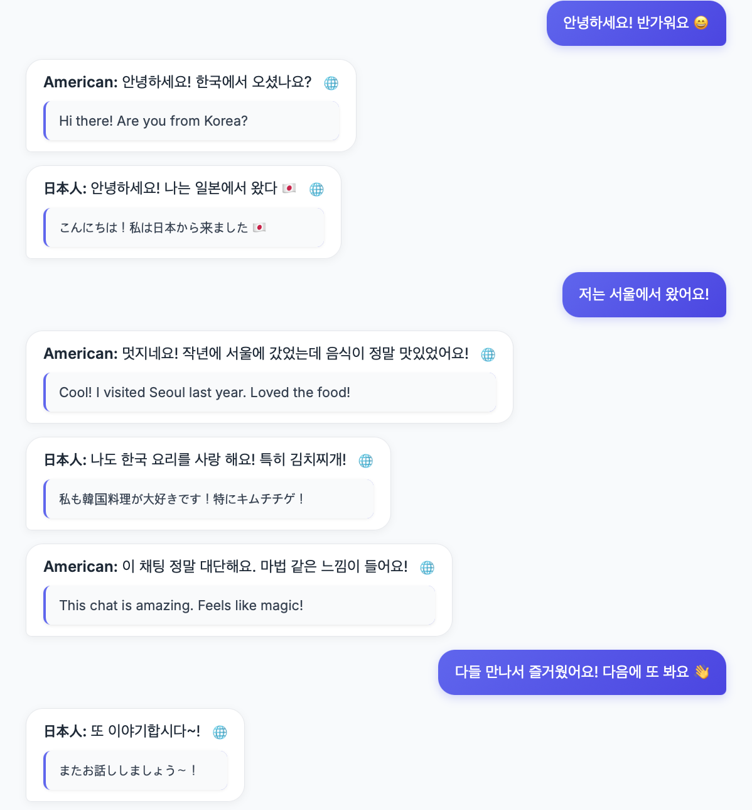

# 🌐 Real-time Multi-language Chat Web

---

## 🖼️ 대표 실행 화면

> 아래는 프로젝트 실행 시의 대표 예시입니다.  
> 예: 한국인, 미국인, 일본인이 서로 다른 언어로 대화하며 번역된 메시지를 실시간으로 확인하는 장면.



실시간 다국어 채팅 웹 서비스입니다.  
한국인, 미국인, 일본인 등 서로 다른 언어 사용자들이 **자신의 언어로 입력한 메시지를 자동 번역**하여 실시간으로 대화할 수 있습니다.  
Socket.io를 기반으로 한 양방향 통신과 Google Cloud Translation API를 통해 **즉각적인 언어 변환**을 제공합니다.

---

## 🚀 프로젝트 개요

- **개발 목적**: 언어 장벽 없이 자연스럽게 대화할 수 있는 실시간 채팅 환경 구축
- **핵심 기능**: 메시지 자동 번역, 국가별 언어 감지, 실시간 소켓 통신, 채팅 내역 저장 및 삭제
- **개발 기간**: 2025.09 ~ 2025.10
- **개발 인원**: 1인 (개인 프로젝트)

---

## 🧩 기술 스택

| 구분            | 기술                         |
| --------------- | ---------------------------- |
| **Frontend**    | HTML, CSS, JavaScript        |
| **Backend**     | Node.js, Express             |
| **Real-time**   | Socket.io                    |
| **Database**    | MongoDB (Mongoose)           |
| **API**         | Google Cloud Translation API |
| **Environment** | dotenv, nodemon              |

---

## ⚙️ 주요 기능

### 1. 실시간 다국어 채팅

- Socket.io를 이용해 사용자 간 실시간 메시지 송수신
- Google Translate API로 자동 번역 처리

### 2. 사용자 국가 언어 감지

- 입력된 국가 정보를 기반으로 자동 언어 설정

### 3. 메시지 저장 및 초기화

- MongoDB에 채팅 내역 저장
- 관리용 스크립트(`clearChat.js`)로 전체 대화 삭제 가능

---

## 🧱 프로젝트 구조

```
node_prac/
├── public/
│   ├── index.html
│   ├── style.css
│   └── script.js
├── index.js
├── clearChat.js
├── package.json
├── .env
└── README.md
```

---

## 🔧 개선 아이디어

- 사용자 언어 자동 감지 고도화 (브라우저 언어 기반)
- 번역 API 호출 최적화 (중복 번역 최소화)
- 사용자별 메시지 로그 다운로드 기능 추가

---

## 📎 개발자 메모

본 프로젝트는 **실시간 통신과 번역 API 연동의 구조적 이해**를 목표로 제작되었습니다.  
단순한 기능 구현을 넘어, 다국어 환경에서도 안정적으로 작동하는 데이터 흐름을 설계하는 데 중점을 두었습니다.
